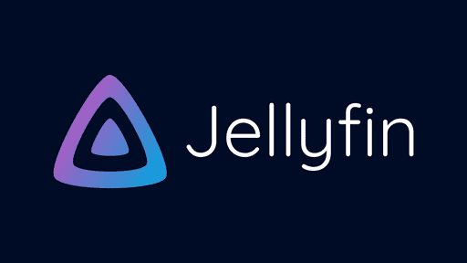

# JellyBot - Jellyfin Discord Bot

Bot discord qui notifie le statut d'un serveur multimédia Jellyfin et de ses nouveaux contenus. 
[Jellyfin](https://jellyfin.org/) est un serveur multimedia open source que vous pouvez hébergez vous-même ! 



## Requis

- [python](https://www.python.org/)
- [pip](https://pypi.org/project/pip/)
- [discord.py](https://discordpy.readthedocs.io/en/stable/)
- [requests - PyPI](https://pypi.org/project/requests/)
- Un accès administrateur à un serveur Jellyfin.
- Une clé API sur ce serveur.

## Sommaire
- [Fonctionnalités](#fonctionnalités)
- [Installation](#installation)
- [Configuration](#configuration)
  - [Discord](#discord)
  - [Channel Discord](#channel-discord)
  - [Jellyfin](#jellyfin)
- [Annexes](#annexes)

## Fonctionnalités

- Notification régulier de l'état du serveur
- Notification de nouveaux épisodes mis en ligne
- Recevoir des recommendations des utilisateurs via le channel textuel

## Commandes Disponibles

- `/state` - Notifie l'état du serveur
- `/latest` - Notifie les nouveaux épisodes mis en ligne
- `/suggest param1 param2 paramN` - Envoie des recommendations au serveur

## Idées d'ajouts futures

- Trouver des Idées d'ajouts futures (!)
- Traduire en anglais la documentation
- Améliorer et agrandir le README
  
# Installation

1. Cloner le repo

### Méthode HTTPS

```bash
git clone https://github.com/Doruo/JellyBot.git
```
### Méthode SSH 

#### (Il faut utiliser un mot de passe chiffré par une clé SSH publique)

```bash
git clone https://github.com/Doruo/JellyBot.git
```

2. Installer les dépendances nécessaires
```bash
pip install discord.py requests python-dotenv
```

3. Ouvrer un terminal dans le dépot, et lancer l'installation:

Sur Windows :

```powershell
./install/install.ps1
```

Sur Linux :
```bash
./install/install.bash
```
Cela vous ouvrira un script qui va automatiquement configurer l'application.
Il faudra saisir plusieurs informations configuration qui vous sont confidentielles. 
Pour cela, vous pouvez voir comment retrouvez ces informations dans la section Configuration.

4. Lancer le bot

Sur Windows 

Il faut d'abord authoriser l'execution de script powershell :

```powershell
Set-ExecutionPolicy RemoteSigned -Scope CurrentUser
```
Puis executer le script de lancement :

```powershell
./scripts/run.ps1
```

Sur Linux :
```bash
./scripts/run.bash
```

# Configuration

## Discord

1. Créer une application sur [Discord Developer Portal](https://discord.com/developers)
2. Dans l'onglet "Bot", créer un bot
3. Cliquer sur "Reset Token" pour générer un nouveau token
4. Copier ce token et le coller lors du script d'installation (Discord Token)
5. Inviter le bot sur votre serveur en utilisant le lien d'invitation généré dans l'onglet "OAuth2"

## Channel ID Discord

1. Activer le mode développeur dans Discord (Paramètres > Avancés)
2. Faire clic droit sur le canal souhaité et "Copier l'identifiant"
3. Le coller lors du script d'installation (Discord Channel ID)

## Jellyfin - API Key et URL

1. Dans Jellyfin, aller dans Dashboard > API Keys
2. Générer une nouvelle clé API
3. Copier cette clé dans votre script d'installation (API Key)
4. Ajouter l'URL de votre serveur lors du script d'installation (Hostname & Port)
5. To find your admin user id : connect to your jellyfin website as Admin > Left Panel > Users > your user, and copy the user Id from the url.
3. Le coller lors du script d'installation (Admin user ID)

# Annexes

- [Jellyfin - The Free Software Media System](https://jellyfin.org/)
- [Jellyfin Documentation](https://jellyfin.org/docs/)
- [Discord Developer Portal](https://discord.com/developers)
- [discord.py Documentation - API Wrapper python library](https://discordpy.readthedocs.io/en/stable/)
